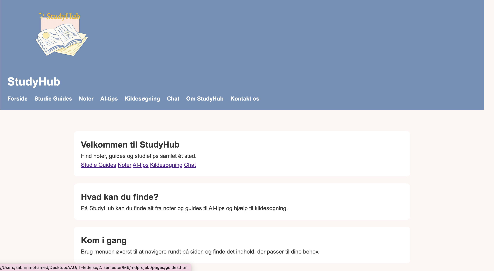
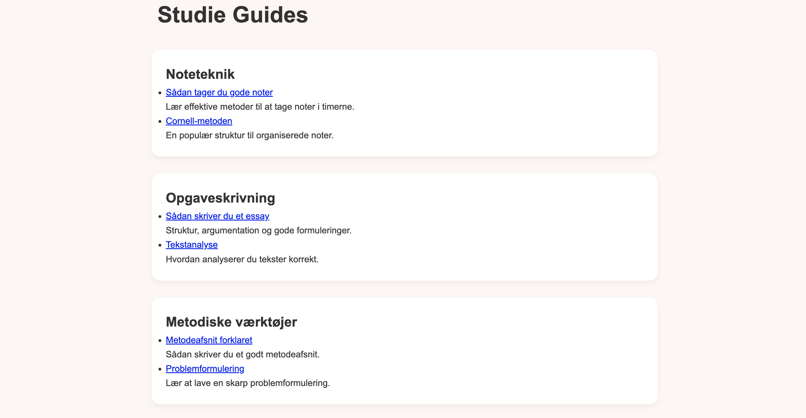
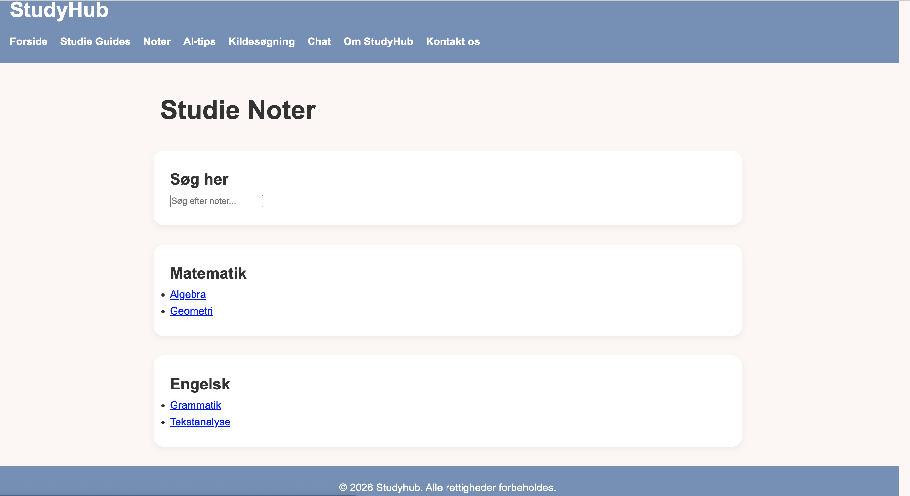
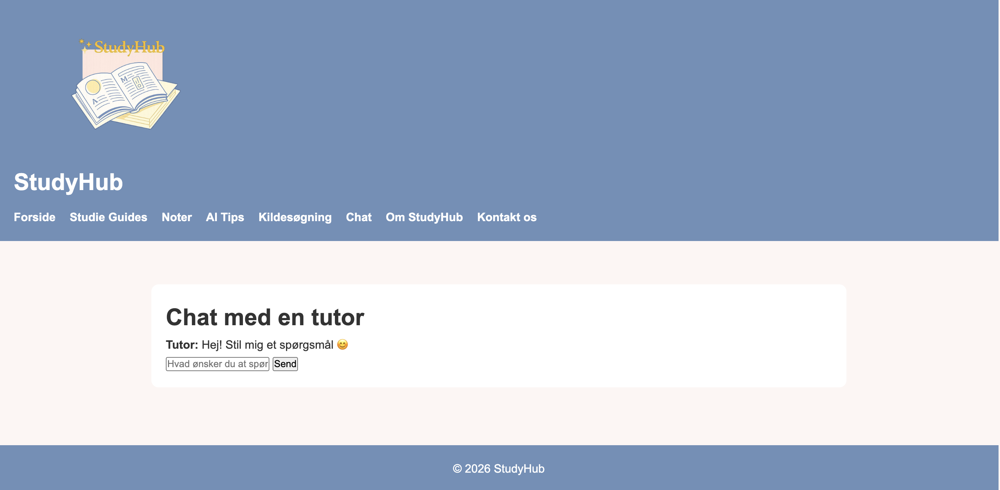

# StudyHub

StudyHub er en hjemmeside designet til studerende, hvor de kan finde noter, guides og studietips inden for forskellige fagområder.

Det er en basis-hjemmeside med mulighed for videreudvikling og løbende tilføjelser af noter og andre relevante studieteknikker/dokumenter. 

## Features

- Noter og guides
- Navigere mellem emner
- Forskellige studieteknikker såsom kildesøgning og brug af AI. 
- Søgefunktion
- Chatfunktion
- Brugervenligt og intuitivt

## Tech Stack

Projektet er bygget med:

- HTML5
- CSS3
- JavaScript

## Projektstruktur

```bash
m6projekt/
│
├── css/          # Stylesheets
├── docs/         # Dokumentation
├── images/       # Billeder og assets
├── js/           # JavaScript-filer
├── pages/        # Undersider
├── index.html    # Forside
└── README.md
```

## Installation

Clone repositoryet:

```bash
git clone https://github.com/mayajoyrosendahl123/m6projekt.git
```

Åbn projektmappen:

```bash
cd m6projekt
```

Åbn derefter `index.html` i browseren.

## Usage

Projektet kan bruges direkte i browseren uden ekstra installation.

Du kan:

- navigere mellem siderne
- læse studieindhold
- udforske AI-værktøjer
- finde studietips og ressourcer

## Screenshots

### Forside


### Studie Guides


### Noter


### Chat


## Fremtidige forbedringer

- Login-system for admin med mulighed for at tilføje noter og studieteknikker samt rette siderne til
- Login-system for tutor hvor de kan tilgå chat funktionen
- Gemme noter og favoritter
- Backend/database integration

## License

Dette projekt er lavet til uddannelsesformål.
