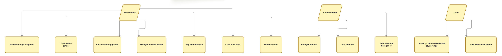
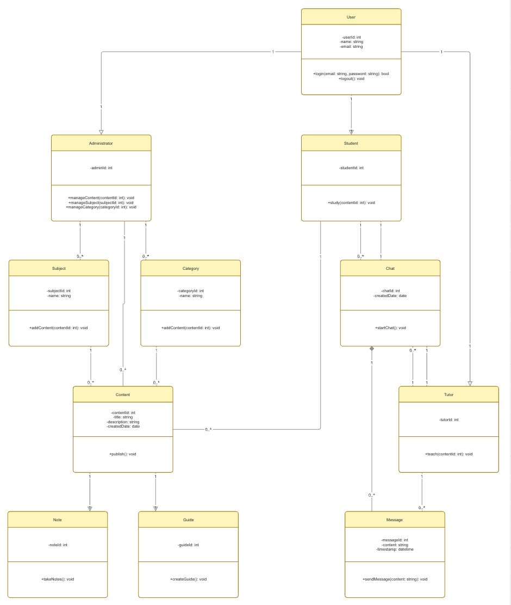

## UML Design for StudyHub

For at skabe en fælles forståelse for hvad hjemmesidens krav og design er,
har vi anvendt use case diagram og klassediagram som modelleringsværktøj. 

I StudyHub anvendes UML til at modellere systemets funktionelle krav gennem
use cases, og systemets objekter, attributter og relationer gennem et 
klassediagram (Sommerville, 2016, s.141). 

Systemets formål og funktioner kan læses i dokumentet: Projektbeskrivelse.

Den nuværende StudyHub er udviklet som en statisk prototype med HTML, CSS og 
Javascript og er udviklet uden backend og database. Vores UML designs skal 
dermed ses som fremtidig design for hjemmesiden. Hvis hjemmesiden senere skal 
videreudvikles, kan koden koden gradvist refaktoreres i en mere objektorienteret 
retning. Det betyder, at eksisterende funktioner som søgning, noter, guides og 
chat kan samles i JavaScript-klasser, mens fremtidige funktioner som login, 
brugerroller, administratoradgang og tutor-chat kan implementeres som nye 
klasser. Den nuværende kode kan dermed struktureres mere modulært over tid. 

## Use Case diagram

Use case diagrammet viser de forskellige aktører og deres interaktion med
hjemmesiden (Sommerville, 2016, s.141). Indtil videre er hjemmesiden kun udviklet med udgangspunkt i
den studerendes interaktion med hjemmesiden, men det endelige design skal
også indeholde administrator og tutor. 

**Aktør: Studerende**

Den studerende er den primære bruger af StudyHub og kan:
- Se fag og kategorier
- Gennemse emner
- Læse noter og guides (mangler backend)
- Søge efter indhold
- Navigere mellem emner
- Starte en chat med en tutor (kun hypotetisk i den nuværende prototype)

Disse use cases understøtter projektets mål om at give studerende adgang
til læringsressourcer og studiestøtte.

**Aktør: Administrator**

Administratoren har ansvar for vedligeholdelse af hjemmesidens indhold:
- Oprette indhold
- Redigere indhold
- Slette indhold
- Administrere kategorier

Disse funktioner sikrer, at StudyHub kan udvikles og opdateres løbende,
hvilket også fremgår af projektbeskrivelsen. 

**Aktør: Tutor**

Tutoren understøtter de studerende gennem:
- Besvarelse af beskeder

Dette understøtter chatfunktionen og hjælper studerende med faglige 
spørgsmål. 

## Klassediagram

Klassediagrammet viser den strukturelle opbygning af StudyHub (Sommerville, 2016, s.141). Designet er
baseret på objektorienteret principper, hvor fælles funktionalitet samles
i klassen User, som specialeres gennem rollerne Student, Tutor og
Adminstrator. Dette gør det nemmere at udvide hjemmesiden med nye brugerroller
i fremtiden. 

Indholdet på StudyHub modelleres gennem Content-klassen, som specialiseres
til Noter og Guides. Dette afspejler hjemmesidens primære funktioner, hvor
brugerne kan tilgå forskellige typer af læringsmateriale såsom noter og guides.
Løsningen gør det muligt at tilføje nye indholdstyper i fremtiden uden større
ændringer i den eksisterende struktur.

Klassediagrammets illustrerer også hjemmesidens fremtidige udvikling, som kan
udvides med brugerroller, adminsitration af indhold samt en mere avanceret 
chatfunktion mellem studerende og tutor. 

